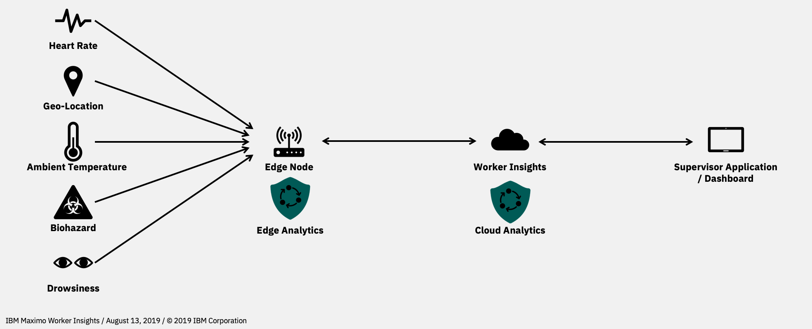

#  IBM® Maximo® Worker Insights
## Table of contents
|   Topics   |
|----------|
|[1. Introduction](##introduction)|
|[2. Installation](##installation)|

## Introduction
With edge analytics, IBM Maximo Worker Insights can support scenarios in which workers cannot use mobile phones.

- **Sensors**  
  A variety of sensors can connect to the edge node. These sensors provide environmental and biometric information to the edge node.
- **Edge Node**  
  The edge node - also called edge gateway - is a computational unit with a Linux operating system, which is connected to the internet. Multiple sensors connect directly to the edge node. On the edge node, the IBM Maximo Worker Insights software stack for edge analytics is running. Shields - small and independent programs - analyse the metrics from the sensors and create hazards if defined conditions are met.
- **Worker Insights on IBM Cloud**  
  Additionally to the edge analytics, the edge node integrates seamlessly with IBM Maximo Worker Insights on IBM Cloud.
- **Supervisor Application and Dashboard**  
  Each hazard - regardless if it was detected by edge or cloud analytics - are visualized on the mobile app (available for iOS and Android) and the dashboard.

### Further Reading
- IBM Maximo Worker Insights on [IBM Watson IoT](https://www.ibm.com/internet-of-things/solutions/enterprise-asset-management/worker-insights)
- IBM Maximo Worker Insights on [IBM Marketplace](https://www.ibm.com/us-en/marketplace/iot-safer-workplace)
- IBM Maximo Worker Insights on [IBM Knowledge Center](https://www.ibm.com/support/knowledgecenter/SSQNYQ_bas/worker-insights/kc_welcome_bas.html)

## Installation
### <a name="prerequisites"></a> Prerequisites
As a Business Partner, information (such as gateway credentials) is provided to you by the IBM Maximo Worker Insights team. The following information is needed:
- `WIOTP_ORG` - Watson IoT Platform organization
- `WIOTP_REGION` - Watson IoT Platform region. Possible values are: us, uk, ch, de, nl
- `WIOTP_DEVICE_TYPE` - Watson IoT Platform gateway type
- `WIOTP_DEVICE_ID` - Watson IoT Platform gateway ID
- `WIOTP_DEVICE_TOKEN` - Watson IoT Platform gateway device token
- `MWI_TENANT` - IBM Maximo Worker Insights tenant ID
- `MWI_CONTEXT` - IBM Maximo Worker Insights organization
- `MWI_USER_ID` - IBM Maximo Worker Insights user ID of the gateway
- `LOG_DNA_KEY` - LogDNA key if available

### Procedure
1. **Get the scripts**  
Clone the git repository by running the following command:
  ```shell
  git clone git@github.com:ibm-watson-iot/mwi-edge-gateway.git
  ```
Either clone the scripts directly onto the edge node or clone it locally onto your computer and then transfer them onto your edge node. If you transfer files, you can copy them securely by using the `scp` command.

2. **Set the variables**  
Open the file `envvars.sh` with a text editor of your choice. Enter the values listed in the [Prerequisites](#prerequisites) section:
```shell
# *****************************  EDIT HERE ***************************** #
# Watson IoT Platform
WIOTP_ORG=""
WIOTP_REGION="" # us,uk,ch,de,nl
WIOTP_DEVICE_TYPE=""
WIOTP_DEVICE_ID=""
WIOTP_DEVICE_TOKEN=""
# IBM Maximo Worker Insights
MWI_HOST=""
MWI_TENANT=""
MWI_CONTEXT=""
MWI_USER_ID=""
# LogDNA (optional)
LOG_TO_CLOUD=true
LOG_DNA_KEY=""
# **************************** EDIT END ******************************** #
```
When you are done editing the `envvars.sh`, save it and transfer the whole repository to the edge node.

3. **Become root user**  
On the edge node, switch to `sudo` or `root` user by executing either of the following commands:
```shell
su -
```
or
```shell
sudo su
```

4. **Make the script executable**  
To ensure that the script can be executed, make it executable by running following command:
```shell
chmod +x ./setup.sh
```

5. **Start the installation**
Start the installation procedure by executing the following command:
```shell
./setup.sh
```
The installation completes in a couple of minutes.

6. **Check if installation was successful**  
After the setup script finishes and exits without errors printed on the terminal, the edge node downloads docker containers and configuration files, synchronizes with IBM Maximo Worker Insights on cloud starts the edge analyitics software stack. This will take about 2 minutes. After this period, you can check the status by running the following command:
```shell
hzn agreement list
```
The output looks similar to the following snipped sample and indicates that Horizon successfully synchronised with the server and started the Docker containers according to the service definition.
```json
 [
  {
    "name": "db4_internetofthings.ibmcloud...",
    "current_agreement_id": "0e44521718adb0043f1dcc2314c805...",
    "consumer_id": "IBM/...",
    "agreement_creation_time": "2019-06-06 18:10:40 +0200 CEST",
    "agreement_accepted_time": "2019-06-06 18:10:47 +0200 CEST",
    "agreement_finalized_time": "",
    "agreement_execution_start_time": "",
    "agreement_data_received_time": "",
    "agreement_protocol": "Basic",
    "workload_to_run": {
      "url": "https://internetofthings.ibmcloud.com/service/iot-gateway-client",
      "org": "IBM-WorkerInsight",
      "version": "1.1.0",
      "arch": "arm64"
    }
  }
]
```
To confirm that the containers are running, you can execute the following command:
```shell
docker ps
```
You should see 3 containers running.
